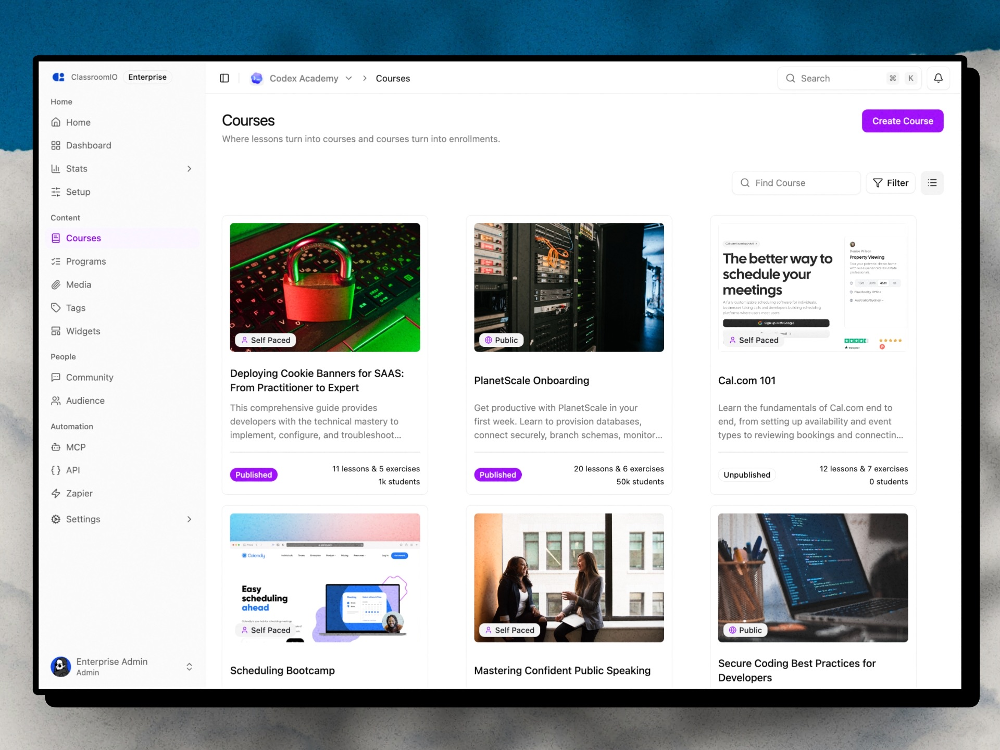
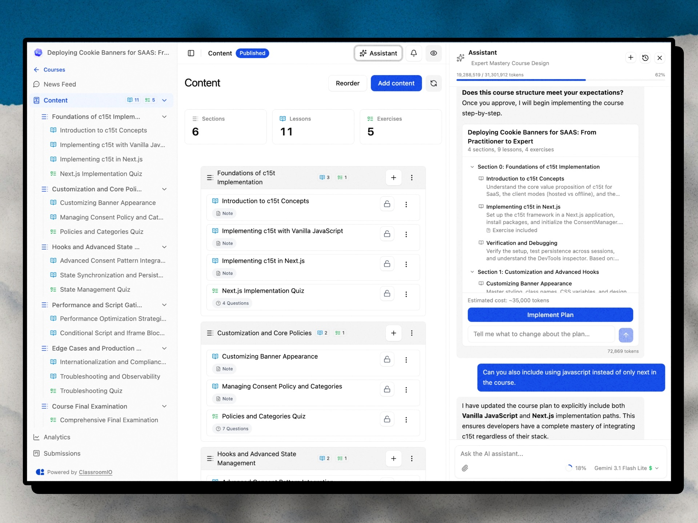
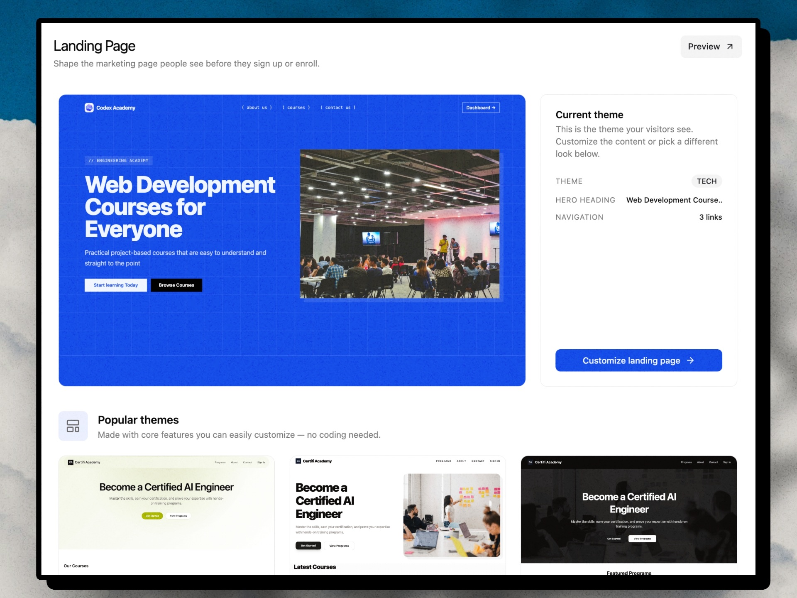
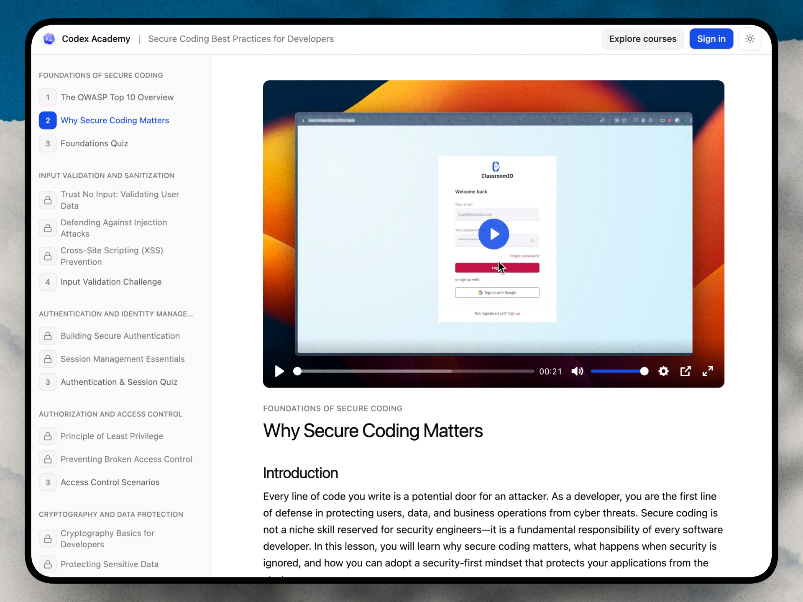
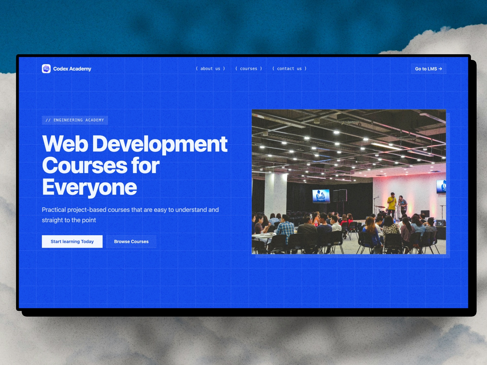

<div align="center">
  <h1>GurukulX</h1>
  <p><strong>AI-Powered Learning Management System</strong></p>
  <p>Create courses with AI, manage students, issue certificates, and run your academy — all from one platform.</p>

  <br />

  
  
  
  
</div>

---

## 🎯 What is GurukulX?

GurukulX is a **full-stack Learning Management System** built as a hackathon project that rivals enterprise solutions. It combines AI-powered course creation, real-time student management, and a beautiful branded academy experience into one cohesive platform.

<div align="center">
  
</div>

---

## ✨ Key Features

| Feature | Description |
|---------|-------------|
| 🤖 **AI Course Builder** | Generate complete courses from a topic or document in minutes |
| 📚 **Course Management** | Rich multimedia lessons, exercises, quizzes, and structured content |
| 👥 **Student Management** | Enrollment, progress tracking, groups, and communication |
| 🎓 **Certificates** | Auto-generated branded certificates on course completion |
| 🌐 **Custom Domains** | White-label academy on your own domain |
| 📊 **Analytics & Reports** | Completion rates, quiz scores, engagement metrics |
| 💬 **Community & Discussions** | Built-in forums and Q&A for peer learning |
| 🎨 **Theming & Branding** | Full customization — colors, logos, layouts |
| 🔐 **Authentication** | Email/password, Google OAuth, SSO support |
| ⚡ **Automation** | Webhooks, API, Zapier integration, auto-enrollment |
| 🌍 **Multi-Language** | i18n support for 10+ languages |
| 📱 **Responsive Design** | Works seamlessly on desktop, tablet, and mobile |

---

## 🏗️ Architecture

```
┌─────────────────────────────────────────────────────────┐
│                      GurukulX                            │
├─────────────────────────────────────────────────────────┤
│                                                         │
│  ┌───────────┐  ┌───────────┐  ┌───────────────────┐   │
│  │  Website  │  │ Dashboard │  │    Course App     │   │
│  │  (5174)   │  │  (5173)   │  │    (5180)         │   │
│  │ SvelteKit │  │ SvelteKit │  │    SvelteKit      │   │
│  └─────┬─────┘  └─────┬─────┘  └────────┬──────────┘   │
│        │               │                 │              │
│        └───────────────┼─────────────────┘              │
│                        │                                │
│                 ┌──────▼──────┐                          │
│                 │   API Server │                          │
│                 │   (3081)     │                          │
│                 │  Hono + Node │                          │
│                 └──────┬──────┘                          │
│                        │                                │
│           ┌────────────┼────────────┐                   │
│           │            │            │                   │
│     ┌─────▼─────┐ ┌───▼───┐ ┌─────▼─────┐             │
│     │ PostgreSQL │ │ Redis │ │ Better    │             │
│     │  (Neon)    │ │(Upstash)│ │   Auth    │             │
│     └───────────┘ └───────┘ └───────────┘             │
│                                                         │
└─────────────────────────────────────────────────────────┘
```

---

## 🛠️ Tech Stack

| Layer | Technology |
|-------|-----------|
| **Frontend** | SvelteKit 5, Tailwind CSS 4, TypeScript |
| **Backend** | Node.js, Hono, TypeScript |
| **Database** | PostgreSQL (Neon), Drizzle ORM |
| **Cache** | Redis (Upstash) |
| **Authentication** | Better Auth (email, Google, SSO) |
| **AI** | OpenAI / Anthropic (course generation, tutoring) |
| **File Storage** | S3-compatible (MinIO / Cloudflare R2) |
| **Monorepo** | pnpm workspaces |
| **UI Library** | Custom component library (`@cio/ui`) |

---

## 🚀 Getting Started

### Prerequisites

- **Node.js** ≥ 20.x
- **pnpm** ≥ 9.x
- **PostgreSQL** database (or use [Neon](https://neon.tech) free tier)
- **Redis** (or use [Upstash](https://upstash.com) free tier)

### Installation

```bash
# Clone the repository
git clone https://github.com/KiranTejz20005/LMS.git
cd LMS

# Install dependencies
pnpm install

# Set up environment variables
cp apps/api/.env.example apps/api/.env
cp apps/dashboard/.env.example apps/dashboard/.env

# Edit .env files with your database and auth credentials
```

### Running Locally

```bash
# Start the API server (port 3081)
cd apps/api && npm run dev

# Start the Dashboard (port 5173)
cd apps/dashboard && npm run dev

# Start the Website (port 5174) — optional
cd apps/website && npm run dev
```

### Environment Variables

#### API (`apps/api/.env`)
```env
DATABASE_URL=postgresql://...
REDIS_URL=redis://...
PORT=3081
PUBLIC_SERVER_URL=http://localhost:3081
TRUSTED_ORIGINS=http://localhost:5173
BETTER_AUTH_SECRET=your-secret-here
AUTH_COOKIE_DOMAIN=
PUBLIC_IS_SELFHOSTED=true
```

#### Dashboard (`apps/dashboard/.env`)
```env
PUBLIC_IS_SELFHOSTED=true
PUBLIC_SERVER_URL=http://localhost:3081
```

---

## 📁 Project Structure

```
apps/
├── api/              # Backend server (Hono + Node.js)
├── dashboard/        # Admin & student frontend (SvelteKit)
├── website/          # Marketing landing page (SvelteKit)
├── course-app/       # Public course viewer
├── docs/             # Documentation site
├── embeds/           # Embeddable course widgets
├── jobs/             # Background job workers (BullMQ)
└── tenant-router/    # Multi-tenant routing (Cloudflare Worker)

packages/
├── db/               # Database schema, queries, auth config (Drizzle)
├── ui/               # Shared UI component library
├── utils/            # Shared utilities and validation schemas
├── analytics/        # Analytics package
├── certificates/     # Certificate generation
├── email/            # Email templates and sending
├── jobs/             # Job queue definitions
└── mcp/              # MCP server for AI agent integration
```

---

## 🎓 Core Workflows

### For Instructors
1. **Sign up** → Complete onboarding → Create organization
2. **Create a course** → Use AI builder or manual creation
3. **Add content** → Lessons (text, video, audio), exercises, quizzes
4. **Invite students** → Email invites, links, or bulk import
5. **Track progress** → Analytics dashboard, completion reports
6. **Issue certificates** → Auto-generated on course completion

### For Students
1. **Enroll** → Via invite link or public course catalog
2. **Learn** → Navigate lessons, watch videos, complete exercises
3. **Get help** → AI tutor answers questions 24/7
4. **Earn certificates** → Download and share achievements

---

## 🤖 AI Capabilities

- **Course Generation** — Provide a topic and AI creates a full course structure with lessons and quizzes
- **AI Teaching Assistant** — Context-aware tutor that answers student questions based on course content
- **Quiz Generation** — Automatically create assessments from lesson material
- **Content Suggestions** — AI recommends improvements to course content

---

## 📸 Screenshots

<div align="center">
  <table>
    <tr>
      <td align="center"><br /><em>AI Course Builder</em></td>
      <td align="center"><br /><em>Customizable Academy</em></td>
    </tr>
    <tr>
      <td align="center"><br /><em>Public Course Catalog</em></td>
      <td align="center"><br /><em>Branded Academy Site</em></td>
    </tr>
  </table>
</div>

---

## 🏆 Hackathon

This project was built as a hackathon submission demonstrating:

- **Full-stack engineering** — Complete LMS from database to UI
- **AI integration** — Practical AI features that add real value
- **Production readiness** — Auth, security, error handling, responsive design
- **Scalable architecture** — Monorepo, shared packages, clean separation of concerns
- **Developer experience** — TypeScript throughout, hot reload, component library

---

## 👨‍💻 Author

**Kiran Teja**

- GitHub: [@KiranTejz20005](https://github.com/KiranTejz20005)

---

## 📄 License

This project is licensed under the MIT License.

---

<div align="center">
  <p><strong>⭐ If you found this project impressive, give it a star!</strong></p>
</div>
